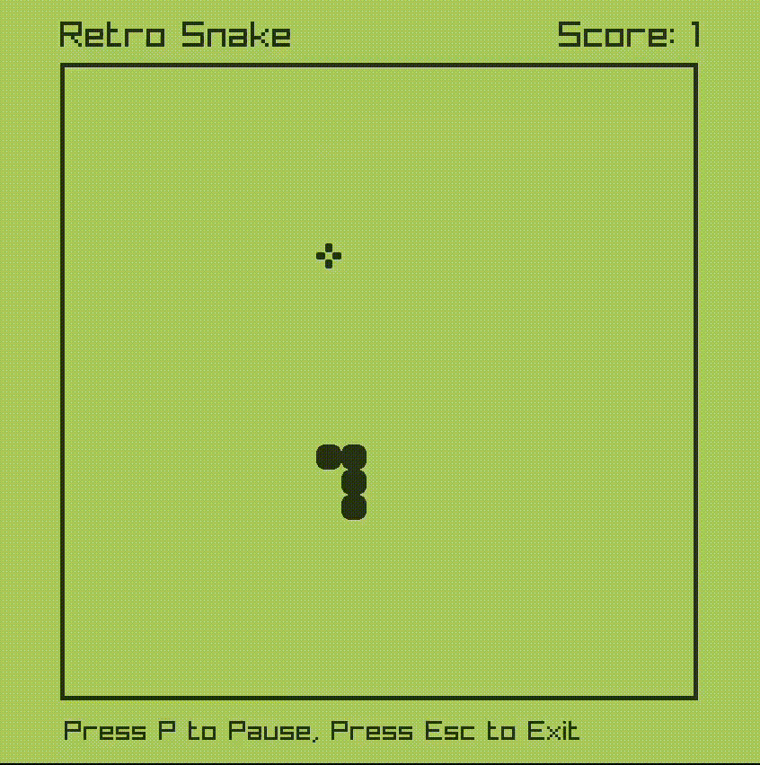

# 🐍 Snake Game



## 📝 Overview

This is your classic arcade Snake game implemented in C++ using the Raylib library and Object-Oriented Programming (OOP) principles. As you know, the snake gets bigger with each bite of food, But did you know that it can get faster too? 😎  
And the speed is reset back when the game ends.

## ✨ Features
- you can pause the game anytime ⏯
- Score Counter

## 🎮 Controls
- **Player:**
  - Up, Down, Left, Right: `Arrow keys`
  - Toggle Play/Pause: `P`
  - Exit: `Esc`

## 📋 Requirements

- C++ compiler (e.g., g++)
- Raylib library

## 💻 Installation

1. **Clone the Repository:**
    ```sh
    git clone https://github.com/g-magdy/snake-game.git
    cd snake-game
    ```

2. **Install Raylib:**
    Follow the instructions on the [Raylib website](https://www.raylib.com/) to install Raylib for your operating system.

3. **Compile the Game:**
    ```sh
    make game
    ```

4. **Run the Game:**
    ```sh
    ./game
    ```

## 📁 Code Structure

- **main.cpp:** Contains the main game loop and initialization code.
- **Constants.h**  Contains global configuration and constants 
- **Game class** Contains the game logic
- **Snake class** Draws and moves the snake
- **Food class** spwans food randomly

## 🤝 Contributing

Currently, I am the only contributor to this project. However, if you have suggestions or improvements, feel free to fork the repository and create a pull request.

## 📄 License

This project is open source and available under the [MIT License](LICENSE).

Enjoy playing the Snake game 🐍!
